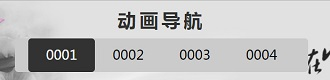

# 原生JavaScript编写特效网页    
    
    该项目基于个人编写的Base库，使用JS面向对象的方式开发；  
    Base库是在开发该项目时，从零编写而成；没有使用第三方类库。  
    从零到有，目的主要锻炼自身的编程能力；  
    由于精力有限，目前暂不兼容IE6、7、8；以后有时间再继续完善Base类库的兼容性；  

**该项目的演示网址：** http://www.forapi.cn/js

|作者|邮箱|网站|  
|:---:|:---:|:---:  
|张焕标33|1140457303@qq.com|http://forapi.cn

## 功能介绍
* [动画导航](#动画导航)
* [换肤](#换肤)
* [banner轮播器](#banner轮播器)
* [拖拽&预加载](#拖拽&预加载)
* [Ajax留言板](#Ajax留言板)  

### 动画导航  

__思路__：导航列表***ul***用***z-index***分为三层：  
* 第一层为默认导航样式；
* 第二层为移动块，移动块中嵌套另一个实现动画的***ul***导航列表；
* 第三层为一个空的***ul***列表，只要依靠第三层实现动画效果；  

当鼠标移动到第三层的***ul***中具体的某个***li***,计算出当前***li***的***left***值，使用**Base**库编写的**animate**动画方法，实现将移动块缓冲移动到当前鼠标悬停的位置，当该动画执行完毕，队列执行将移动块中嵌套的***ul***反方向移动***left***位置，就完成了想要的效果；  

效果图：
